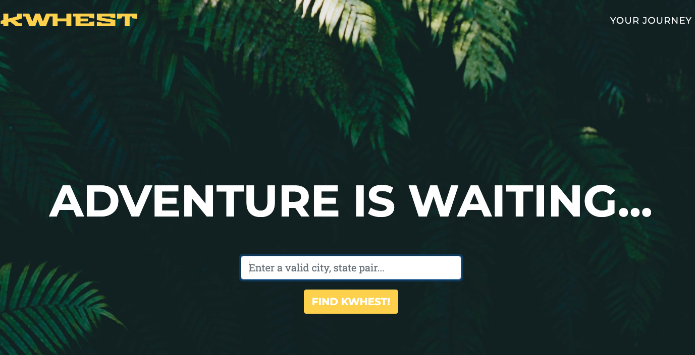

# KWHEST

Welcome to KWHEST (pronounced Quest)!  KWHEST is a one-page adventure finder after you have entered a city/state pair in the location form field.

[GitHub Link](https://github.com/gwyscaver/kwhest)

## Preview

## Download and Installation

To begin using this site, choose one of the following options to get started:
* Clone the repo: `git clone https://github.com/gwyscaver/kwhest.git`
* [Fork, Clone, or Download on GitHub](https://github.com/gwyscaver/kwhest)

## Usage

### Basic Usage

After downloading, simply edit the HTML and CSS files included with the template in your favorite text editor to make changes. These are the only files you need to worry about, you can ignore everything else! To preview the changes you make to the code, you can open the `index.html` file in your web browser.

### Advanced Usage

After installation, run `npm install` and then run `npm start` which will open up a preview of the template in your default browser, watch for changes to core template files, and live reload the browser when changes are saved. You can view the `gulpfile.js` to see which tasks are included with the dev environment.

## Bugs and Issues

Have a bug or an issue with this template? [Open a new issue](https://github.com/BlackrockDigital/startbootstrap-agency/issues) here on GitHub or leave a comment on the [template overview page at Start Bootstrap](http://startbootstrap.com/template-overviews/agency/).

